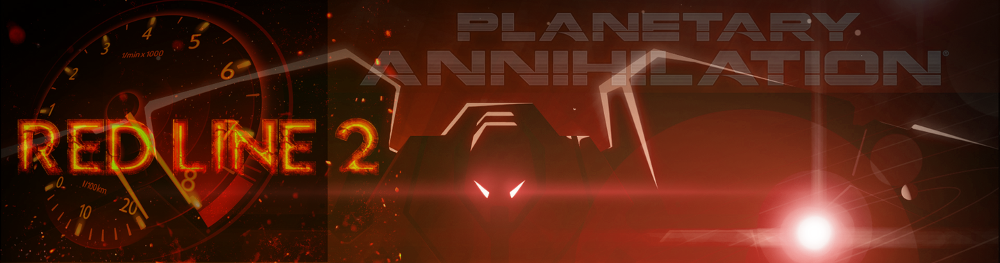
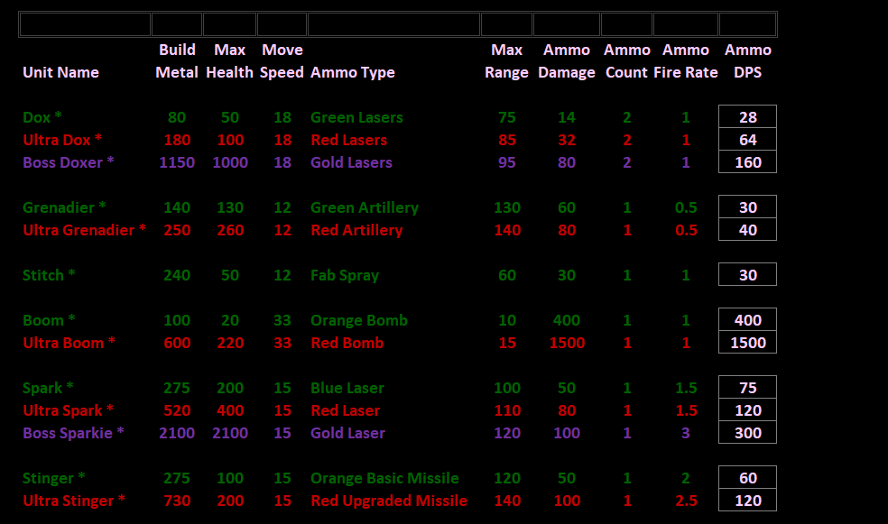
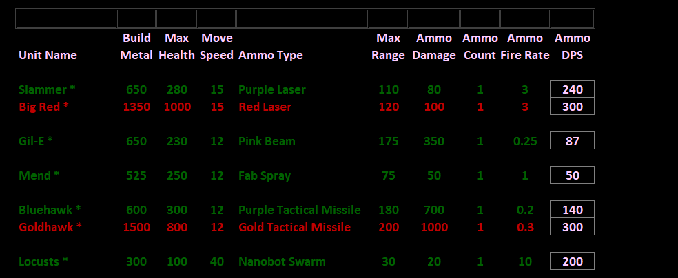
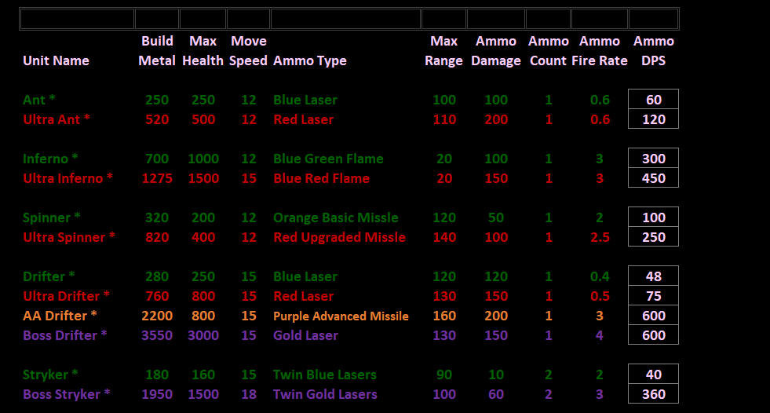
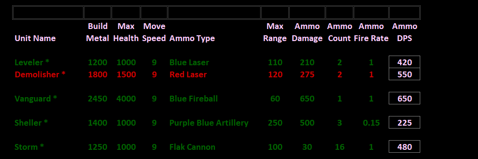
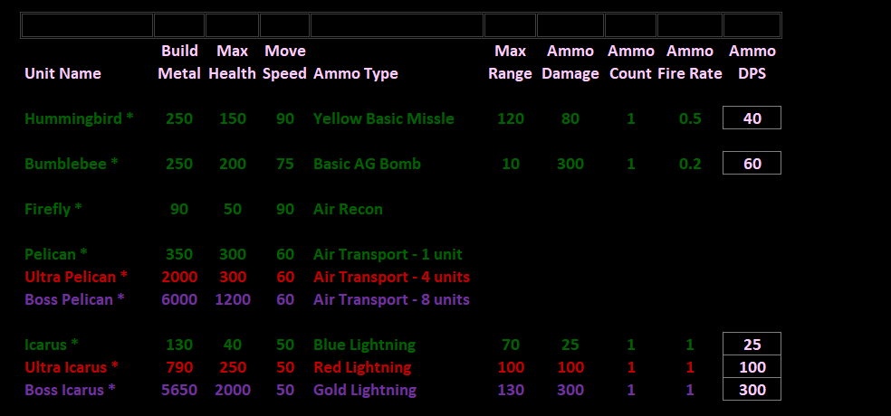
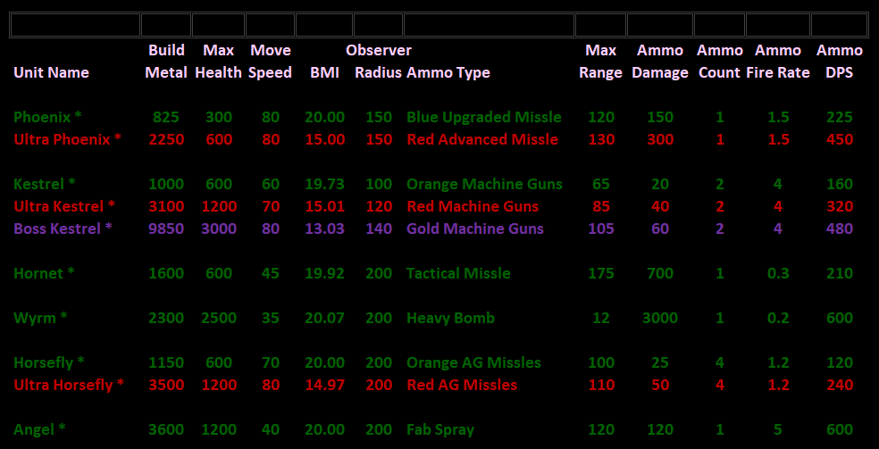
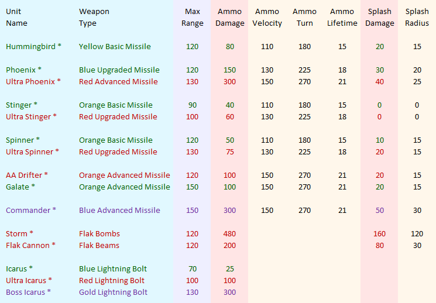

# Red Line 2 Mod for PA - Unit Specs

Red Line 2 is aggressive, balanced, and recognizable to all players - no extra learning required. New units have been added that are optional upgrades to existing units. The game is balanced by making all units equal to 1 dox. The damage, fire rate, weapon range, move speed, and unit health are calclulated such that all units are equal. This includes water units, air units, and multiple weapons. To play on maps designed for Red Line 2, download the *#gb6 Definitive map pack* available in community mods.

### Basic Bots

### Advanced Bots

### Basic Vehicles

### Advanced Vehicles

### Basic Air

### Advanced Air

### Anti-Air Combat

