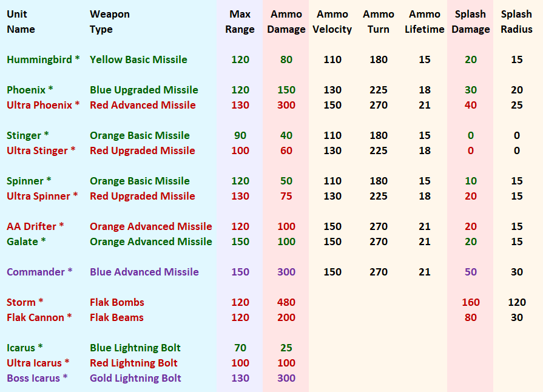

# Red Line 2 Mod for PA - Unit Spec

Red Line 2 is aggressive, balanced, and recognizable to all players - no extra learning required. It is recommended you play Red Line 2 using maps from the *#gb6 Definitive map pack* available in community mods. Red Line 2 is compatible with Legion Expansion.

### Basic Bots

### Advanced Bots

### Basic Vehicles

### Advanced Vehicles

### Basic Air

### Advanced Air

### Anti-Air Combat

